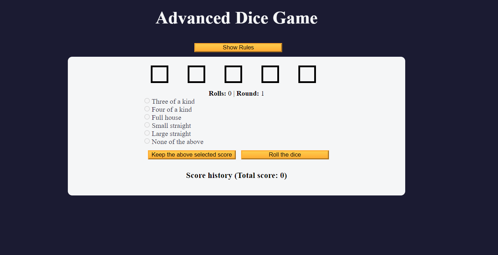
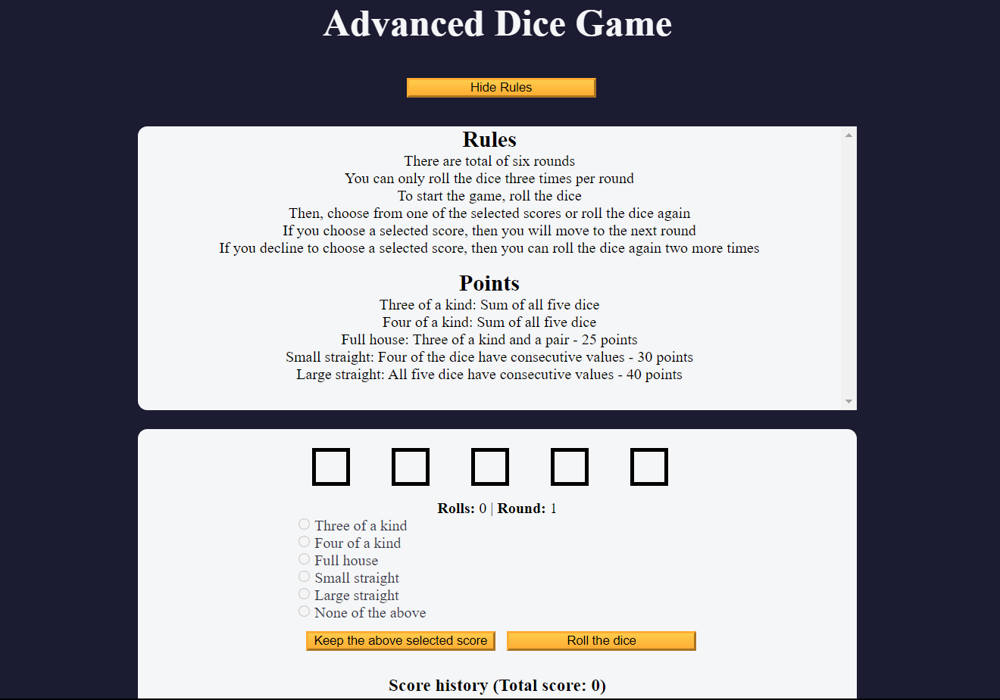

# Dice-Game [Website Game](https://kumarshivam04203.github.io/Dice-Game/)

# Project Description
Dice game project, you’ll learn how to manage the game state, implement game logic for rolling dice, keeping score, and apply rules for various combinations.

This project covers concepts such as event handling, array manipulation, conditional logic, and updating the user interface dynamically based on game state.

